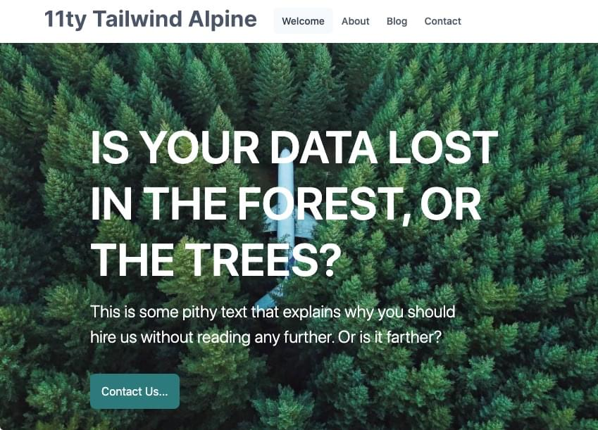
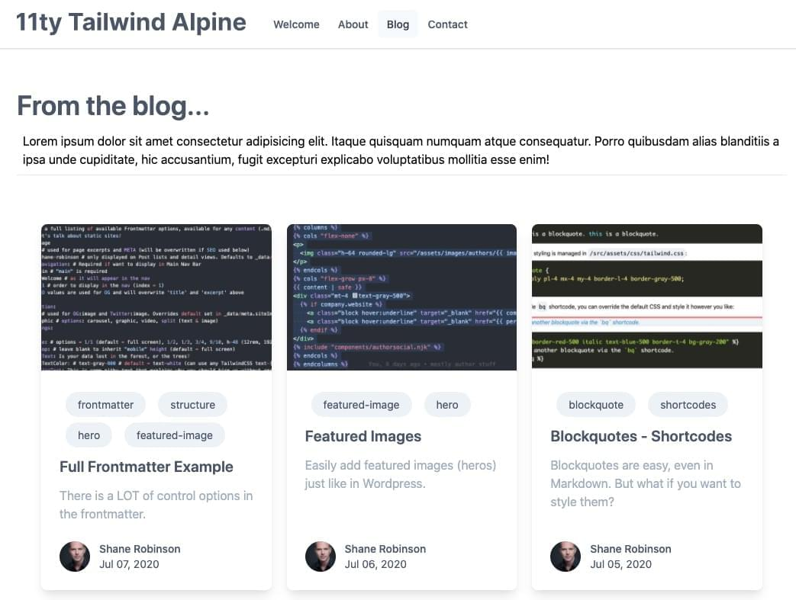

What started out as a plan to update an [11ty](https://11ty.dev '11ty Static Site Generator'), [TailwindCSS](https://tailwindcss.com 'TailwindCSS Utility-First CSS Framework'), [Alpine.js](https://github.com/alpinejs/alpine 'Alpine.js : Think of it like Tailwind for JavaScript') starter project I had previously created _(and that served as the starter for this site)_, turned into a week+ project that ended in a highly-customizable, full-featured "CMS of sorts" using a combination of Frontmatter and 11ty data files.

The demo site is currently live but the GitHub repo is still private.

I still have a lot of instructions to draft on how it all works. And still have to create the README file before taking the repo public.

But I'm thrilled with how it turned out and will be using it as the starter for several Wordpress => 11ty conversions planned next.

Here's a sneak peek of **one** of the home page options _(there are currently 4 hero options)_:

And a peek at 1-of-3 Post Lists layout options:

