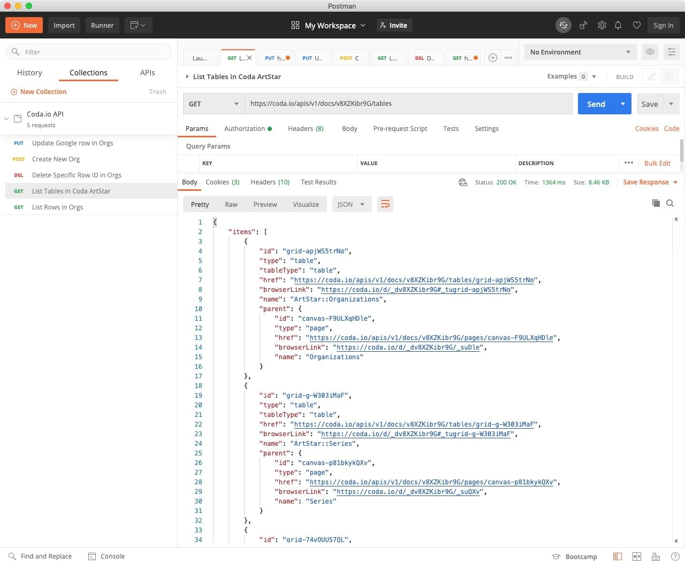

Coda.io recently launched [v1.0.0 of their API](https://coda.io/developers/apis/v1) and so today I spent some time exploring it with [Postman](https://www.postman.com/).

This was my first time using Postman and I found it quite intuitive and easy to use.

Nothing to report yet... But I have an idea for a #100DaysOfCode project which uses [Coda.io](https://coda.io) to provide content for [11ty](https://11ty.dev '11ty Static Site Generator').

