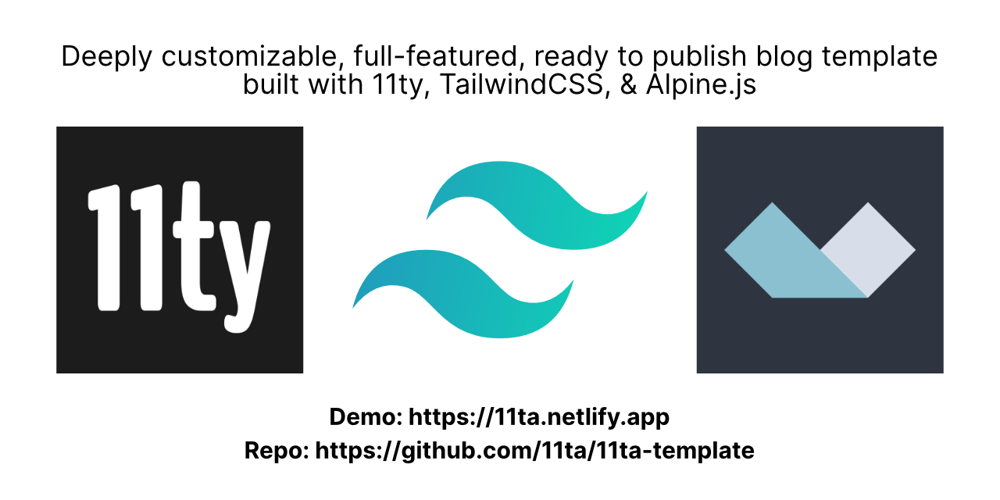

Well... It's been a while since I posted an update on my #100DaysOfCode website. Lots happening in these past 2+ weeks. But in terms of this #100DaysOfCode project, the most important update is that I officially launched my [11ty](https://11ty.dev "11ty Static Site Generator"), [TailwindCSS](https://tailwindcss.com "TailwindCSS Utility-First CSS Framework"), [Alpine.js](https://github.com/alpinejs/alpine "Alpine.js : Think of it like Tailwind for JavaScript") template system that I call: **[11TA](https://11ta.netlify.app)**





The [11TA Template System](https://11ta.netlify.app "11TA Static Site Template System") demo site actually serves as the feature list and example of how a website would look out of the box with no customization. The [11TA Blog Posts](https://11ta.netlify.app/blog/) each highlight a different feature and its usage. 

I’m not going to repeat information that's already on the 11TA site. If you're interested in building static sites with one of the most flexible and powerful SSG _(static site generators)_, hope over to my [11TA Template System](https://11ta.netlify.app "11TA Static Site Template System") and read the feature list and installation instructions on the home page and check out the blog.

If you have questions, [give me a shout on Twitter](https://twitter.com/shanerobinson "Shane Robinson on Twitter") and I'll answer best I can. 